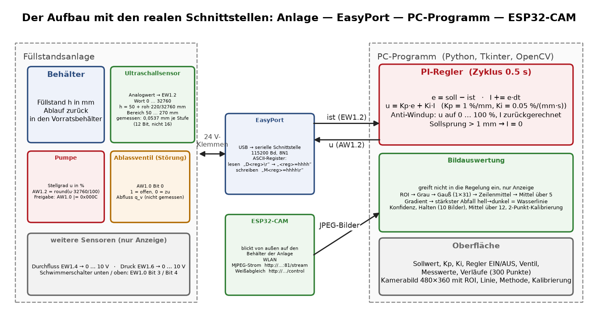

# Wasserstandsregelung mit optischer Füllhöhenerkennung

Prof. Dr.-Ing. Ralph Wystup M.Sc. — erstellt mit KI und Agent (Claude Code, Anthropic)

**Seite öffnen:** https://ralphwystup.github.io/Wasserstandsregelung-mit-optischer-Fuellhoehenerkennung/ — ein gezeichneter Behälter im Browser, darauf dieselbe Bildauswertung und derselbe PI-Regler
wie im Programm der Anlage, mit laufenden Verläufen, zwei Versuchen gegen die Python-Rechnung und dem Manuskript als
Reiter. Läuft offline.

Ein durchsichtiger Behälter wird von einer Pumpe gefüllt und läuft über einen Rücklauf wieder leer. Ein
Ultraschallsensor misst die Füllhöhe über einen EasyPort (USB, ASCII-Registerprotokoll); ein PI-Regler mit Anti-Windup
auf dem PC stellt die Pumpe im Takt von 0,5 s. Ein Ablassventil erzeugt auf Knopfdruck eine Störung. Parallel dazu
blickt eine ESP32-CAM auf denselben Behälter: das Programm sucht die Wasserlinie **im Bild** — über den stärksten
Helligkeitsabfall von oben nach unten, wahlweise über Canny-Kanten oder einen HSV-Farbfilter — und rechnet sie über eine
Zweipunktkalibrierung in Millimeter um. Die Bildauswertung greift dabei **nicht** in die Regelung ein; sie ist der
zweite, unabhängige Messweg auf dieselbe Größe.

Das Streckenmodell stammt aus einer gemessenen Sprungantwort (25.06.2026, 370 Punkte): ein PT1-Glied mit Totzeit,
K_u = 1,8748 mm/%, T = 36,69 s, T_d = 1,25 s. Der geschlossene Kreis ist damit geschlossen durchgerechnet
(ζ = 0,78, Phasenreserve 70°) und auf zwei unabhängigen Wegen bestätigt.

## Was drin ist

| Datei | Inhalt |
|:--|:--|
| [`Wasserstand_1.0.html`](Wasserstand_1.0.html) | die Seite: gezeichneter Behälter, Bildauswertung, Regler, Verläufe, Versuche, Dokumentation |
| [`MANUSKRIPT_Wasserstand.pdf`](MANUSKRIPT_Wasserstand.pdf) | das Manuskript: Aufbau und Register, Bildauswertung Schritt für Schritt, Regler, Behältermodell mit Herleitung, geschlossener Kreis, Bedienung, was offen ist |
| `MANUSKRIPT_Wasserstand.md`, `MANUSKRIPT_Wasserstand.docx` | dasselbe als Quelle (Markdown) und als Textverarbeitungsdatei |
| `pc/Wasserstandsregelung_Bild_6.py` | das Programm am PC: EasyPort, PI-Regler, Bildauswertung, Oberfläche |
| `modell/` | Anpassung der Modelle an die Messung (`streckenmodell.py`), die geschlossene Gegenrechnung (`nachrechnung.py`), die wörtlich herausgeschnittene Bildauswertung (`bv_referenz.py`) und ihre Probe |
| `daten/` | die Messreihe der Sprungantwort vom 25.06.2026 |
| `bilder/` | die gezeichneten Bilder und ihr Erzeuger; dazu ein Bildschirmfoto der Programmoberfläche |
| `seite/`, [`PRUEFPLAN_Seite.md`](PRUEFPLAN_Seite.md) | Erzeuger und Prüfmittel der Seite, der Prüfplan mit allen Schranken |
| `index.html` | leitet auf die Seite weiter, damit GitHub Pages sie unter der Adresse oben zeigt |

Die Netzadresse der Kamera ist in dieser Veröffentlichung durch einen Platzhalter ersetzt. Kennwörter und Netznamen
kommen in diesem Aufbau nicht vor.

## Lizenz

MIT, siehe [LICENSE](LICENSE).
